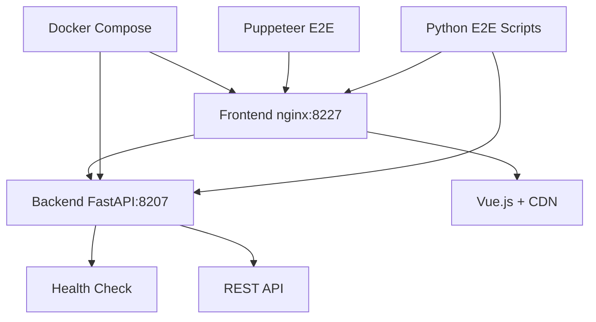

# 🎯 MaskService 01 - Modernizacja Systemu Testowania Masek

> **Migracja z c201001.mask.services → 01.mask.services**  
> Nowoczesna architektura mikrousług z Vue.js + FastAPI + Docker

[](https://opensource.org/licenses/MIT)
[](https://vuejs.org/)
[](https://fastapi.tiangolo.com/)
[](https://docs.docker.com/compose/)

## 📋 Spis treści

- [🎯 Cel projektu](#-cel-projektu)
- [🏗️ Architektura](#️-architektura)
- [🚀 Szybki start](#-szybki-start)
- [🧪 Testowanie E2E](#-testowanie-e2e)
- [📁 Struktura projektu](#-struktura-projektu)
- [⚙️ Komendy Makefile](#️-komendy-makefile)
- [🔧 Komponenty](#-komponenty)
- [📄 Dokumentacja](#-dokumentacja)

## 🎯 Cel projektu

**MaskService 01** to zmodernizowana platforma do testowania masek ochronnych, zaprojektowana z myślą o:

- **Modularności** - każdy komponent jako osobny mikrousługa
- **Skalowalności** - łatwe dodawanie nowych funkcji
- **Niezawodności** - testy E2E i automatyzacja CI/CD
- **Użyteczności** - intuicyjny interfejs Vue.js

### 🎯 Status migracji

| Komponent | Status | Porty | Uwagi |
|-----------|--------|-------|-------|
| ✅ **Login** | Gotowy | 8101/8201 | Autoryzacja multi-role |
| ✅ **Dashboard** | Gotowy | 8102/8202 | Menu kontekstowe |
| ✅ **System** | Gotowy | 8104/8204 | Monitoring systemu |
| ✅ **Tests** | Gotowy | 8103/8203 | Framework testowy |
| ✅ **Devices** | **Naprawiony** | 8207/8227 | MIME/export errors fixed |
| 🔄 **Reports** | W trakcie | 8108/8208 | Generowanie raportów |
| 🔄 **Service** | W trakcie | 8109/8209 | Panel serwisowy |
| 🔄 **Settings** | W trakcie | 8110/8210 | Konfiguracja systemu |
| 🔄 **Workshop** | W trakcie | 8111/8211 | Warsztat techniczny |

## 🏗️ Architektura



### 🔧 Stack technologiczny

- **Frontend**: Vue.js 3 (CDN), vanilla CSS, Nginx
- **Backend**: FastAPI, Python 3.9+, uvicorn
- **Konteneryzacja**: Docker Compose
- **Testy E2E**: Puppeteer + Python requests
- **Proxy**: Nginx z konfiguracją SPA
- **Porty**: 82xx range (8207 backend, 8227 frontend)

## 🚀 Szybki start

### Wymagania

- Docker + Docker Compose
- Python 3.9+
- Make
- curl

### Instalacja

```bash
# 1. Klonowanie
git clone <repo-url>
cd 01.mask.services

# 2. Sprawdzenie dostępnych komend
make help

# 3. Start konkretnego komponentu (np. devices)
cd page/devices
make docker-up

# 4. Weryfikacja
curl http://localhost:8207/health  # Backend
curl http://localhost:8227/        # Frontend
```

### Dostęp do aplikacji

| Komponent | Frontend | Backend | Opis |
|-----------|----------|---------|------|
| **Devices** | http://localhost:8227 | http://localhost:8207 | Wybór urządzeń testowych |
| **Login** | http://localhost:8201 | http://localhost:8101 | Autoryzacja użytkowników |
| **Dashboard** | http://localhost:8202 | http://localhost:8102 | Panel główny |

## 🧪 Testowanie E2E

### Nowe funkcje testowe

Dodano kompleksowy system testów E2E z automatycznym zarządzaniem kontenerami:

```bash
# Wszystkie testy E2E (wymaga uruchomionych kontenerów)
make test-e2e

# E2E z automatycznym zarządzaniem kontenerami
make e2e-with-containers

# Testy specyficzne dla komponentów
make e2e-login      # Test flow logowania
make e2e-devices    # Test devices page  
make e2e-reports    # Test reports page
make e2e-flow       # Test pełnego flow login→dashboard
```

### Testy na poziomie komponentu

```bash
cd page/devices

# E2E z zarządzaniem Docker (zalecane)
make e2e

# Tylko testy Puppeteer (headless browser)
make e2e-puppeteer

# Health check
make test-health
```

### 🔍 Co testują skrypty E2E

- **Backend health checks** - sprawdzenie endpointów `/health`
- **Frontend accessibility** - ładowanie HTML/CSS/JS
- **Vue.js rendering** - sprawdzenie działania komponentów
- **Navigation flow** - przejścia między stronami
- **MIME types** - poprawność serwowania plików statycznych
- **Authentication** - testowanie różnych ról użytkowników

## 📁 Struktura projektu

```
01.mask.services/
├── 📄 README.md              # Ten dokument
├── 📄 Makefile                # Główne komendy projektu
├── 📄 components.md           # Plan migracji komponentów
├── 📄 todo.md                 # Status postępów
│
├── 📁 page/                   # Kompletne strony (frontend + backend)
│   ├── devices/               # ✅ Naprawione (MIME/export errors)
│   │   ├── js/0.1.0/          # Vue.js frontend
│   │   │   ├── index.html     # Entry point
│   │   │   ├── devices.js     # Główny komponent
│   │   │   ├── devices.css    # Style (naprawiony MIME)
│   │   │   └── package.json   # NPM config
│   │   ├── py/0.1.0/          # FastAPI backend
│   │   │   ├── main.py        # API server
│   │   │   └── requirements.txt
│   │   └── docker/0.1.0/      # Docker setup
│   │       ├── docker-compose.yml
│   │       ├── nginx.conf     # Naprawiona konfiguracja
│   │       ├── Dockerfile.frontend
│   │       ├── Dockerfile.backend
│   │       └── puppeteer-test.js
│   ├── login/                 # ✅ Gotowy
│   ├── dashboard/             # ✅ Gotowy  
│   ├── reports/               # 🔄 W trakcie
│   └── ...
│
├── 📁 module/                 # Współdzielone komponenty
│   ├── auth/                  # Autoryzacja
│   ├── header/                # Nagłówek
│   ├── footer/                # Stopka
│   └── menu/                  # Menu kontekstowe
│
├── 📁 scripts/                # 🆕 Narzędzia E2E i automatyzacja
│   ├── test_login_flow.py     # E2E login→dashboard
│   ├── test_devices_page.py   # E2E devices (naprawiony port 8207)
│   ├── test_complete_flow.py  # Pełny flow aplikacji
│   ├── advanced_puppeteer_testing.py
│   └── ...
│
└── 📁 shared/                 # Zasoby globalne
    ├── css/                   # Style współdzielone
    ├── locales/               # Tłumaczenia
    └── assets/                # Obrazy, ikony
```

## ⚙️ Komendy Makefile

### Główne komendy (root)

```bash
# 📊 Informacje o projekcie
make help              # Pokazuje wszystkie dostępne komendy
make status            # Status wszystkich komponentów
make show-ports        # Alokacja portów dla usług

# 🏗️ Build i deploy
make build-all         # Build wszystkich komponentów
make docker-build-all  # Build obrazów Docker
make docker-up-all     # Start wszystkich kontenerów (uwaga: konflikty portów)

# 🧪 Testowanie
make test-all          # Testy jednostkowe wszystkich komponentów
make test-docker-all   # Testy Docker dla wszystkich komponentów
make health-check-all  # Health check wszystkich usług

# 🎯 E2E Testing (nowe!)
make test-e2e          # Wszystkie testy E2E (kontenery muszą być uruchomione)
make e2e-with-containers # E2E z automatycznym zarządzaniem kontenerami
make e2e-login         # Test flow logowania
make e2e-devices       # Test devices page
make e2e-reports       # Test reports page  
make e2e-flow          # Test pełnego flow

# 🧹 Czyszczenie
make clean-all         # Usuń wszystkie artefakty build
make stop-all          # Zatrzymaj wszystkie usługi
make docker-cleanup-all # Wyczyść zasoby Docker

# 🔧 Komponenty (przykłady)
make dev-devices       # Start devices w trybie dev
make build-page-login  # Build tylko strony login
```

### Komendy komponentów (page/*)

```bash
cd page/devices

# 🏗️ Development
make dev               # Start w trybie development
make build             # Build komponentu
make clean             # Wyczyść artefakty

# 🐳 Docker
make docker-build      # Build obrazów Docker
make docker-up         # Start kontenerów
make docker-down       # Stop kontenerów
make docker-test       # Test kontenerów

# 🧪 Testing
make test              # Testy jednostkowe
make test-health       # Health check (8207/8227)
make e2e               # 🆕 E2E z zarządzaniem Docker
make e2e-puppeteer     # 🆕 Testy Puppeteer (headless)
```

## 🔧 Komponenty

### ✅ Devices Page (devices)

**Status**: **Naprawiony** - usunięto błędy MIME type i export declarations

**Funkcjonalność**:
- Interaktywny wybór urządzeń testowych (PP_MASK, NP_MASK, SCBA, CPS)
- Vue.js 3 z reaktywnymi komponentami
- Dynamiczne wstrzykiwanie stylów CSS
- Integracja z istniejącym systemem urządzeń

**Naprawione problemy**:
- ❌ `devices.css` MIME type "text/html" → ✅ "text/css"
- ❌ "export declarations may only appear at top level of a module" → ✅ Usunięto ES6 exports
- ❌ Nginx SPA fallback dla CSS → ✅ Dedykowana obsługa statycznych assets

**Porty**: Backend 8207, Frontend 8227

**Testowanie**:
```bash
cd page/devices
make e2e  # Start → test → stop (automatic)
```

### ✅ Login Page (login)  

**Status**: Gotowy
**Funkcjonalność**: Multi-role authentication (OPERATOR, ADMIN, SUPERUSER)
**Porty**: Backend 8101, Frontend 8201

### ✅ Dashboard Page (dashboard)

**Status**: Gotowy  
**Funkcjonalność**: Kontekstowe menu użytkownika, nawigacja między stronami
**Porty**: Backend 8102, Frontend 8202

## 📄 Dokumentacja

| Plik | Opis |
|------|------|
| 📄 `README.md` | Ten dokument - główna dokumentacja |
| 📄 `components.md` | Szczegółowy plan migracji komponentów |
| 📄 `todo.md` | Status postępów i pozostałe zadania |
| 📄 `migration_from_1001.md` | Instrukcje migracji z c201001 |

### 🔗 Przydatne linki

- [Vue.js 3 Documentation](https://vuejs.org/)
- [FastAPI Documentation](https://fastapi.tiangolo.com/)
- [Docker Compose Reference](https://docs.docker.com/compose/)
- [Puppeteer API](https://pptr.dev/)

## 🤝 Współpraca

### Dodawanie nowej strony

```bash
# Ręczne utworzenie struktury
mkdir -p page/[nazwa]/{js,py,docker}/0.1.0

# Skopiowanie szablonów
cp -r page/devices/* page/[nazwa]/
# Edytuj pliki according to new component requirements
```

### Dodawanie nowego modułu

```bash
mkdir -p module/[nazwa]/{js,py}/0.1.0
# Implement shared functionality
```

### Zgłaszanie problemów

1. Sprawdź czy kontener działa: `make test-health`
2. Sprawdź logi: `docker logs [container-name]`
3. Uruchom testy E2E: `make e2e`
4. Sprawdź dokumentację komponentu w `page/[nazwa]/README.md`

---

**MaskService 01** - Nowoczesna platforma testowania masek ochronnych  
🏭 *Przemysł 4.0 meets Respiratory Protection* 🛡️
